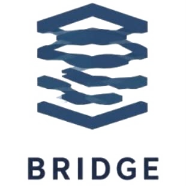

<div align="center">
  

  <h1>BRIDGE</h1>
  <p><strong>Offline-First Production Intelligence for Industrial Building Material SMEs</strong></p>

  <p align="center">
    
    
    
    
    
    
  </p>

  <p align="center">
    An industrial-grade production intelligence platform designed for Indonesian building material manufacturers and small-to-medium enterprises (IKM). Replaces error-prone paper logbooks with rapid offline shop floor logging, automated data synchronization, real-time OEE tracking, and AI-driven recipe optimization to reduce material waste by 8-12%.
  </p>
</div>

## Tech Stack


## Project Overview

Traditional small and medium scale building material factories (such as ceramic tile, brick, and roof tile manufacturers in industrial clusters like Plered, West Java) suffer from critical operational inefficiencies:
1. Paper-based logging on dusty factory floors causes lost records, illegible entries, and 24 to 48 hour reporting delays.
2. Inconsistent raw material mixing (clay-to-water ratios, chemical binders) and unmonitored kiln temperature variations generate 8-12% preventable scrap rates.
3. Factory owners lack real-time visibility into Overall Equipment Effectiveness (OEE), shift productivity, and defect root causes.

BRIDGE resolves these operational bottlenecks through a resilient two-tier architecture:
- BRIDGE Collect: An ultra-fast, offline-first digital logbook tablet interface for factory foremen (mandors) that operates reliably without internet connectivity.
- Owner Intelligence Suite: A comprehensive executive command dashboard providing real-time OEE telemetry, shift-level audits, financial ROI tracking, and prescriptive batch recipe recommendations.

## Core Architectural Pillars

### 1. Offline-First Resilience on the Factory Floor
Industrial factory floors frequently experience dead zones with zero cellular or Wi-Fi signal. BRIDGE employs a client-side offline storage model:
- Sub-2-Minute Shift Logging: Foremen can complete entire machine operational logs with minimal friction, touch-optimized numeric steppers, and zero typing.
- Hard and Soft Input Guards: Dynamic validation boundaries prevent clerical typos (for example, warning when kiln temperatures deviate outside 900-1150 deg C or clay moisture exceeds safe limits).
- PIN Sign-off: Secure 4-digit PIN authentication guarantees shift accountability without cumbersome password entry.
- Auto-Sync Buffer: Data is persisted locally and automatically synchronizes with the central cloud database as soon as network connectivity is restored.

### 2. Prescriptive Decision Intelligence
Beyond passive reporting, BRIDGE includes a Decision Intelligence engine tailored to local raw material profiles. By correlating raw clay batch characteristics with final kiln yield outcomes, the system generates prescriptive recipe adjustments for upcoming production batches to minimize thermal cracking and dimensional defects.

### 3. Comprehensive Factory Command Center
The Owner Suite aggregates shop floor telemetry into 15 integrated analytical modules:
- Real-time OEE monitoring (Availability, Performance, Quality indices)
- Machine operational status and kiln temperature tracking
- Defect breakdown and root cause diagnostics
- Shift handover audit trails and mandor compliance scoring
- Material inventory levels and reorder projections
- Financial yield analysis, COGS variance, and automated PDF executive reporting

## Application Portals and Routes

The application is structured into four specialized route groups:

### 1. Marketing & Digital Showcase (`/`)
- Public landing page presenting the platform value proposition, field pilot validation metrics from the Plered cluster, customer testimonials, and an interactive bento-grid feature breakdown.
- Built with Lenis smooth scrolling, spring-based Framer Motion micro-interactions, and responsive glassmorphism navigation.

### 2. Mandor Shop Floor Portal (`/mandor`)
- Tablet-optimized interface designed specifically for factory supervisors and machine operators.
- Features machine-level parameter inputs (kilns, ball mills, hydraulic presses), shift timeline views, maintenance calendar logs, and handover verification protocols.

### 3. Executive Owner Dashboard (`/owner`)
- Password-protected command portal giving business owners and plant directors complete operational oversight.
- Includes 15 operational tabs covering real-time telemetry, AI decision intelligence, financial metrics, quality control, employee performance, sustainability metrics, and exportable reports.

### 4. Prototype Simulation Hub (`/prototype`)
- Interactive diagnostic hub that simulates the end-to-end system initialization pipeline (Nginx reverse proxy, frontend assets, backend API, PostgreSQL storage, and the Decision Intelligence inference service).

## Repository Structure

```text
bridge-landing-page/
├── app/
│   ├── mandor/
│   │   └── page.tsx              # Mandor tablet interface
│   ├── owner/
│   │   └── page.tsx              # Owner executive suite
│   ├── prototype/
│   │   └── page.tsx              # Prototype diagnostic hub
│   ├── globals.css               # Global styling and design tokens
│   ├── layout.tsx                # Root layout with Lenis provider and fonts
│   └── page.tsx                  # Public landing page
├── components/
│   ├── mandor/                   # Shop floor foreman UI modules
│   ├── owner/                    # Executive dashboard analytical tabs
│   ├── ui/                       # Radix UI and shadcn component primitives
│   ├── activations-section.tsx   # Industry case studies and modal flows
│   ├── bento-grid.tsx            # 3D interactive feature cards
│   ├── click-spark.tsx           # Particle click interaction component
│   ├── flavor-carousel.tsx       # Product showcase carousel
│   ├── footer.tsx                # Demo booking and inquiry footer
│   ├── hero-section.tsx          # Parallax hero section
│   ├── lenis-provider.tsx        # Smooth scroll context wrapper
│   ├── navigation.tsx            # Responsive glassmorphism navbar
│   ├── social-section.tsx        # Field pilot validation gallery
│   └── theme-provider.tsx        # Theme state provider
├── hooks/
│   ├── use-mobile.ts             # Viewport detection hook
│   └── use-toast.ts              # Toast notification hook
├── lib/
│   ├── decision-intelligence.ts  # Prescriptive recipe algorithms
│   ├── mock-data.ts              # Factory simulation seed datasets
│   └── utils.ts                  # Class merge utilities
├── public/
│   ├── images/                   # Product UI preview screenshots
│   ├── bridge-icon.png           # Platform favicon and badge asset
│   ├── bridge-logo.png           # Platform brand logo
│   └── *.jpg                     # Field validation photographs
├── types/
│   └── bridge.ts                 # Domain type definitions
├── .gitignore
├── components.json               # shadcn/ui configuration
├── next.config.mjs               # Next.js build configuration
├── package.json                  # Dependencies and scripts manifest
├── postcss.config.mjs            # PostCSS configuration
├── tsconfig.json                 # TypeScript compiler configuration
└── README.md
```

## Getting Started

### Prerequisites

- Node.js 18.18 or higher (Node.js 20+ recommended)
- npm, pnpm, or yarn package manager

### Installation

1. Clone the repository:
```bash
git clone https://github.com/ababilkhoerulimam/bridge-landing-page.git
cd bridge-landing-page
```

2. Install dependencies:
```bash
npm install
```

3. Run the development server:
```bash
npm run dev
```

4. Open your browser and navigate to:
- Landing Page: `http://localhost:3000/`
- Mandor Portal: `http://localhost:3000/mandor`
- Owner Dashboard: `http://localhost:3000/owner`
- Prototype Hub: `http://localhost:3000/prototype`

### Building for Production

To create an optimized production build:

```bash
npm run build
```

To run the built production server locally:

```bash
npm start
```

## License

This project is licensed under the MIT License.
